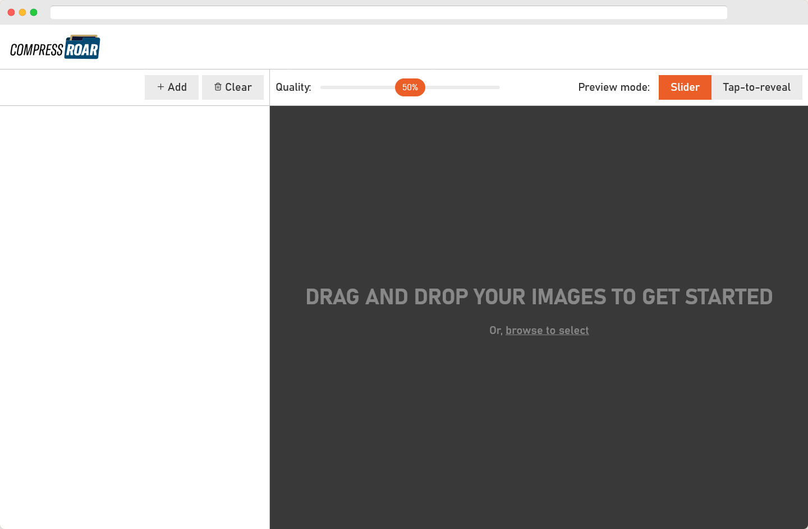

<!-- Improved compatibility of back to top link: See: https://github.com/othneildrew/Best-README-Template/pull/73 -->
<a id="readme-top"></a>


<!-- PROJECT LOGO -->
<br />
<div align="center">
  <a href="https://github.com/joshjavier/image-compressroar">
    
  </a>

  <p align="center">
    Quickly compress images under 100 KB
    <br />
    <a href="https://github.com/joshjavier/image-compressroar"><strong>Explore the docs »</strong></a>
    <br />
    <br />
    <a href="https://compressroar.netlify.app/">View App</a>
    ·
    <a href="https://github.com/joshjavier/image-compressroar/issues/new?labels=bug&template=bug-report-%F0%9F%90%9E.md">Report Bug</a>
    ·
    <a href="https://github.com/joshjavier/image-compressroar/issues/new?labels=enhancement&template=feature-request-%F0%9F%9A%80.md">Request Feature</a>
  </p>
</div>


<!-- TABLE OF CONTENTS -->
<details>
  <summary>Table of Contents</summary>
  <ol>
    <li>
      <a href="#about-the-project">About The Project</a>
      <ul>
        <li><a href="#motivation">Motivation</a></li>
        <li><a href="#built-with">Built With</a></li>
      </ul>
    </li>
    <li>
      <a href="#getting-started">Getting Started</a>
      <ul>
        <li><a href="#prerequisites">Prerequisites</a></li>
        <li><a href="#installation">Installation</a></li>
        <li><a href="#deployment">Deployment</a></li>
      </ul>
    </li>
    <!-- <li><a href="#usage">Usage</a></li> -->
    <!-- <li><a href="#roadmap">Roadmap</a></li> -->
    <!-- <li><a href="#contributing">Contributing</a></li> -->
    <li><a href="#license">License</a></li>
    <!-- <li><a href="#contact">Contact</a></li> -->
    <!-- <li><a href="#acknowledgments">Acknowledgments</a></li> -->
  </ol>
</details>


<!-- ABOUT THE PROJECT -->
## About The Project

<br>
<a href="https://compressroar.netlify.app/" style="display: block; max-width: 800px; margin-inline: auto;">
  
</a>
<br>

Compressroar is a side-project of the BetMGM Manila CMS Team to help streamline the design process when preparing assets for production.

### Motivation

> Or, *Why Another Image Compressor?*

There are already a number of free image compressors online, but these tools often send data to external servers, which is not ideal from a security standpoint.

Also, many of these free tools don't allow designers to fine-tune the level of compression needed for each individual image.

Compressroar aims to solve these problems by providing the following features:

- 🖼️ **Image compression** (currently supports JPG and PNG files)
- 🎚️ **Quality slider** for adjusting compression level
- ✔️ **Validation icons** to easily spot images over 100 KB
- 🔒 **All work is done in the browser,** so no data is sent to a server!

<p align="right">(<a href="#readme-top">back to top</a>)</p>


### Built With

* [![Eleventy][Eleventy.dev]][Eleventy-url]
* [![ESLint][ESLint.org]][ESLint-url]

<p align="right">(<a href="#readme-top">back to top</a>)</p>


<!-- GETTING STARTED -->
## Getting Started

Compressroar is a single-page app built with vanilla JavaScript (no framework). We use Eleventy to generate the static files, which are hosted on Netlify.

To get a local copy up and running, follow these steps:

### Prerequisites

- Node
- npm

### Installation

1. Clone the repo
   ```sh
   git clone https://github.com/joshjavier/image-compressroar.git
   cd image-compressroar
   ```
2. Install NPM packages
   ```sh
   npm install
   ```
3. Run Eleventy Dev Server
   ```sh
   npm start
   ```

### Deployment

Deployments are managed by Netlify and are triggered when pull requests are merged to the `main` (production) and `develop` (staging) branches.

- `develop` is automatically deployed to `develop--compressroar.netlify.app`
- `main` is auto-deployed to `compressroar.netlify.app`

Also, Netlify automatically generates deploy previews when creating or updating pull requests to the `main` and `develop` branches. This is useful for quickly testing functionality when reviewing PRs.

<p align="right">(<a href="#readme-top">back to top</a>)</p>


<!-- USAGE EXAMPLES -->
<!-- ## Usage

Use this space to show useful examples of how a project can be used. Additional screenshots, code examples and demos work well in this space. You may also link to more resources.

_For more examples, please refer to the [Documentation](https://example.com)_

<p align="right">(<a href="#readme-top">back to top</a>)</p> -->


<!-- ROADMAP -->
<!-- ## Roadmap

- [ ] Compute the optimal quality for each image
- [ ] Skip compressing images that are already under 100 KB
- [ ] Dark mode

See the [open issues](https://github.com/joshjavier/image-compressroar/issues) for a full list of proposed features (and known issues).

<p align="right">(<a href="#readme-top">back to top</a>)</p> -->


<!-- CONTRIBUTING -->
<!-- ## Contributing

Contributions are what make the open source community such an amazing place to learn, inspire, and create. Any contributions you make are **greatly appreciated**.

If you have a suggestion that would make this better, please fork the repo and create a pull request. You can also simply open an issue with the tag "enhancement".
Don't forget to give the project a star! Thanks again!

1. Fork the Project
2. Create your Feature Branch (`git checkout -b feature/AmazingFeature`)
3. Commit your Changes (`git commit -m 'Add some AmazingFeature'`)
4. Push to the Branch (`git push origin feature/AmazingFeature`)
5. Open a Pull Request

<p align="right">(<a href="#readme-top">back to top</a>)</p>

### Top contributors:

<a href="https://github.com/joshjavier/image-compressroar/graphs/contributors">
  
</a> -->


<!-- LICENSE -->
## License

Distributed under the MIT License. See `LICENSE.txt` for more information.

<p align="right">(<a href="#readme-top">back to top</a>)</p>


<!-- CONTACT -->
<!-- ## Contact

Your Name - [@twitter_handle](https://twitter.com/twitter_handle) - email@email_client.com

Project Link: [https://github.com/joshjavier/image-compressroar](https://github.com/joshjavier/image-compressroar)

<p align="right">(<a href="#readme-top">back to top</a>)</p> -->


<!-- ACKNOWLEDGMENTS -->
<!-- ## Acknowledgments

* []()
* []()
* []()

<p align="right">(<a href="#readme-top">back to top</a>)</p> -->


<!-- MARKDOWN LINKS & IMAGES -->
<!-- https://www.markdownguide.org/basic-syntax/#reference-style-links -->
[contributors-shield]: https://img.shields.io/github/contributors/github_username/repo_name.svg?style=for-the-badge
[contributors-url]: https://github.com/github_username/repo_name/graphs/contributors
[forks-shield]: https://img.shields.io/github/forks/github_username/repo_name.svg?style=for-the-badge
[forks-url]: https://github.com/github_username/repo_name/network/members
[stars-shield]: https://img.shields.io/github/stars/github_username/repo_name.svg?style=for-the-badge
[stars-url]: https://github.com/github_username/repo_name/stargazers
[issues-shield]: https://img.shields.io/github/issues/github_username/repo_name.svg?style=for-the-badge
[issues-url]: https://github.com/github_username/repo_name/issues
[license-shield]: https://img.shields.io/github/license/github_username/repo_name.svg?style=for-the-badge
[license-url]: https://github.com/github_username/repo_name/blob/master/LICENSE.txt
[linkedin-shield]: https://img.shields.io/badge/-LinkedIn-black.svg?style=for-the-badge&logo=linkedin&colorB=555
[linkedin-url]: https://linkedin.com/in/linkedin_username
[Eleventy.dev]: https://img.shields.io/badge/Eleventy-222?style=for-the-badge&logo=eleventy
[Eleventy-url]: https://www.11ty.dev/
[ESLint.org]: https://img.shields.io/badge/ESLint-4b32c3?style=for-the-badge&logo=eslint
[ESLint-url]: https://eslint.org/
